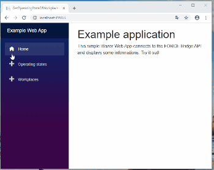
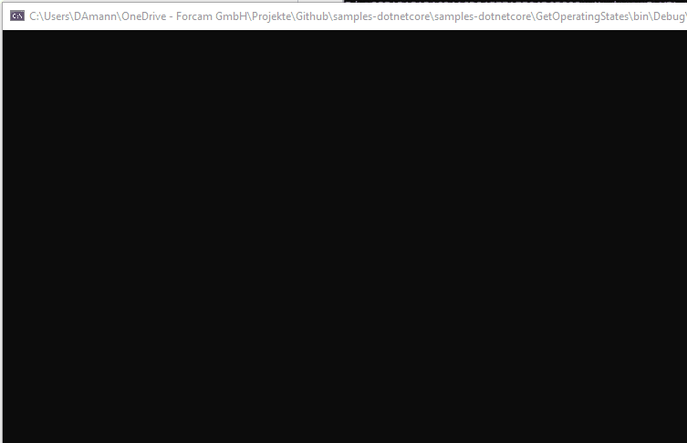
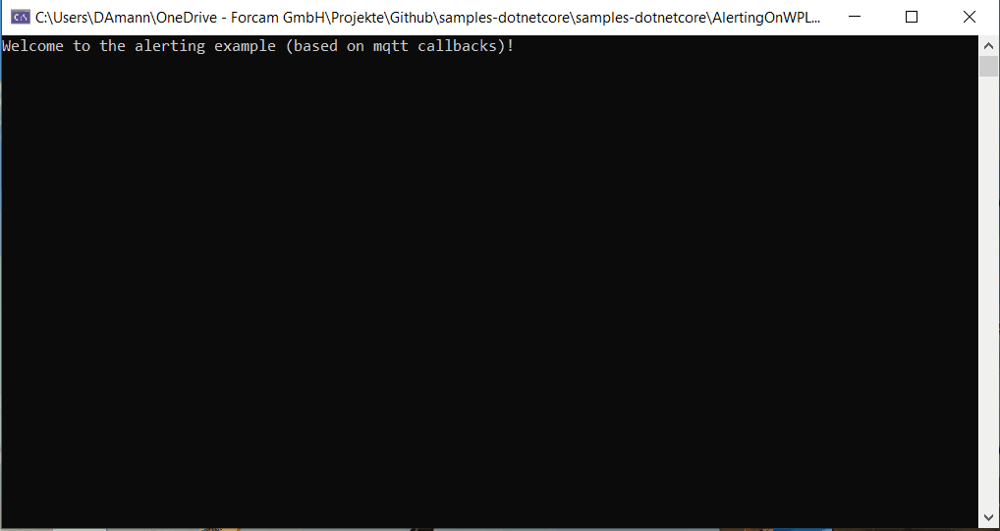

# Sample Applications (C# / .NET Core)

Provides sample applications for using the FORCAM FORCE Bridge API with .NET Core & C#.
If you have any questions look at https://ask.forcebridge.io/

Preview of one of the apps:




### Useful Links

* Website: https://www.forcebridge.io/ | https://www.forcam.com/
* Documentation: https://docs.forcebridge.io/
* ReDoc documentation: https://docs.forcebridge.io/api/
* Swagger documentation: https://forcebridgepublish.force.eco:24443/ffwebservices/swagger/index.html

### Usage / Requirements

###### Access to a FORCAM FORCE Bridge API System

_If you need access to a demo system please contact forcebridge@forcam.com._

Please add your URL, user and password of your Bridge API instance to the variables below (contained by all samples).

```csharp

private const string _urlForTokenGeneration = ""; // YOUR URL (e.g. https://virtualfactory.force.eco:24443/ffwebservices/)
private const string _user; // YOUR USER (e.g. GitHub)
private const string _password; // YOUR PASSWORD (e.g. GitHub)

```

###### Framework & Tools

* .NET Core 3.0 runtime (https://dotnet.microsoft.com/download/dotnet-core/3.0)
* Microsoft Visual Studio 2019 (https://visualstudio.microsoft.com/de/vs/)

### Description of the sample applications:

# Authentication

A small .net core console application wich authenticates to a FORCAM FORCE Bridge API and prints out the token information.


Folder: "Authentication".

# Get all available workplaces

A small .net core console application wich authenticates to a FORCAM FORCE Bridge API, determine all available workplaces and prints them out.


Folder: "GetAvailableWorkplaces".

# Get current operating state of a workplace

A small .net core cosnsole application wich authenticates to a FORCAM FORCE Bridge API, determine the operating state of an workplace and print it.


Folder: "GetOperatingStateOfWorkplace".

# Get all operating states

A small .net core console application wich authenticates to a FORCAM FORCE Bridge API, determine all operating states and prints them out.



Folder: "GetOperatingStates".

# Alerting on workplace operating state change (based on cyclic api requests)

A easy .net core console application which "alerts" if state of given workplace changed to undefined stoppage (Code 999).

Functionality:

1.) Reads first console argument (Cycle-Time) / Default 60 seconds
2.) LOOP (Cycle Time)
2.1) Detect current operating state of the workplace
2.2) If OperatingState is "999" (Undefined Stoppage)
2.2.1) Create a console message

_This procedure is not the "best" way to create a alarming/alerting functionality._
_It is better to use the Bridge API callback functionality (PUSH not PULL)._
_See the following callback examples_


Folder: "AlertingOnWPLOperatingStateChangesBasedOnCyclicRequests"

# Alerting on workplace operating state change (based on mqtt callbacks)

A .net core console application wich register and subscribe to machine state changes over our Callback-Functionality with an MQTT Broker and prints out a alarting message if a specific workplace operating state occures.

Attention: 

Requires an MQTT broker 
(For testing you can use public mqtt-brokers https://github.com/mqtt/mqtt.github.io/wiki/public_brokers).

```csharp

string MQTTTCPUrl = "mqtt://test.mosquitto.org"; // Your broker address
string PORT = "1883";
string MQTTTopicName = "external/statechange"; // "external/" is mandatory

```


Folder: "AlertingOnWPLOperatingStateChangesBasedOnMQTTCallbacks"

# Web App Example

A easy .NET Core Blazor Web App (ASP.NET) which includes some samples like "show all workplaces".


Folder: "WebApp"
